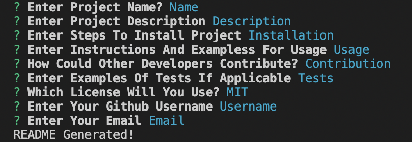

# README.md Generator By Benjamin Jacquez

## Description
Command Line Application That Generates Professional README.md Files
  
## Deployed Website

  
## Table of Contents
- [Description](#description)
- [Deployed Website](#deployed-website)
- [Installation](#installation)
- [Usage](#usage)
- [Contribute](#contribute)
- [Tests](#tests)
- [Questions](#questions)
- [License](#license)
  
## Installation 
Clone Repository And npm install inquirer package

## Usage
start application by running node index.js and submit responses the the prompted tasks
  
## Contribute
contact me with ideas
  
## Tests
adding console.log to functions to check their functionality

## Questions
If You Have Any Questions You Can Reach Me On [Github](https://github.com/Ben-Jacquez) Or Email Me: benjacquez.dev@gmail.com

## License
This Project Is Under The [MIT License](https://opensource.org/license/mit/)

